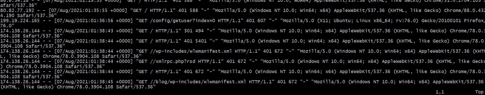
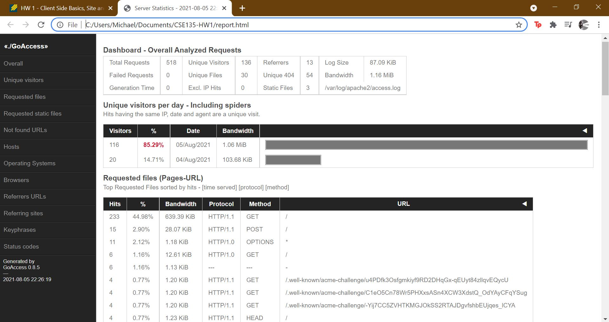

# CSE 135 - HW1 - Client Side Basics, Site and Server Configuration

### Login to Grader user on Apache Server
To login to user "grader", you must input the password to the ssh_key provided(dropletKey) Password is Dafi!1974

The command is ssh grader@164.90.150.34 -i ./dropletKey
The password(if needed) for the grader user after ssh'ing is Grader135

### Website Information
Homepage
[michaelaskndafi.site](https://michaelaskndafi.site)

About Page for team members(just myself) or click on link in homepage:
[https://michaelaskndafi.site/michaelaskndafi.html](https://michaelaskndafi.site/michaelaskndafi.html)

Favicon,robots.txt are under the network information
[hw1/hello.php](https://michaelaskndafi.site/hw1/hello.php)
[hw1/report.html](https://michaelaskndafi.site/hw1/report.html)

### Github deployment setup
I created a [deployment.yml](https://github.com/MikeDafi/cse135-hw1-deployment/blob/main/.github/workflows/deploy.yml) file under which will run the git action if I push to main branch. In doing so, it will run th job of ssh-action in which there are credentials to ssh into my droplet. There is a script following it that will clone the repo and copy the /var/www/ files into the droplet's /var/www/ files, effectively building and deploying the html documents.

### Login information to michaelaskndafi.site
Username: grader
Password: Grader135

### Changes to HTML file for Compression
I had to tell httpd.conf what mime types to be aware of to compress so I had to list them, which caused the content-encoding value in the header response to be 'gzip'. I had to install and enable mod_deflate.so in order to perform this.

### Removing the Server Header
The server header proved to be more difficult than I imagined. I first had to remove the version number of the Apache(since it was initially Server: Apache Version-Number). To do so, I had to go to /etc/apache2/conf-enabled/security.conf and change SererTokens OS to ServerTokens Prod and turn off the ServerSignature. Then to change the word itself i had to install modsecurity and enable it. Then in /etc/apache2/apache.conf I had checked if I had the security module and then added SecServerSignature "CSE135 Server" and two other commands(ServerTokens Min and SecRuleEngine ON). I then restarted the apache server.

initial-index.jpg

modified-index.jpg

validator-initial.jpg 

vhosts-verify.jpg

ssl-verify.jpg

github-deploy.mp4

php-verification.jpg

compression-verify.jpg

header-verify.jpg

error-page.jpg

log-verification.jpg

report-verification.jpg
